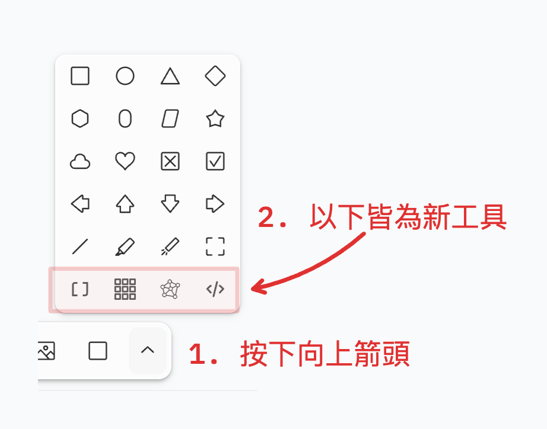

# tldraw for CP

## 這是什麼？
這個工具可以幫助競賽程式選手在 [tldraw](https://www.tldraw.com/) 使用工具更方便的繪製陣列、樹或圖、以及可使用嵌入程式碼撰寫工具。

## 如何使用？
### 部署

1. 開啟終端機，並進入你想要放置這個專案的資料夾

2. 請先確保你的 npm 可以使用，並輸入以下指令
```sh
gh repo clone temmie-950807/tldraw_for_CP
cd tldraw_for_CP
npm install
npm run dev
```

3. 若沒出現問題的話，此時終端機應該出現類似下方的訊息，請點選 Local: 後面的網址（網址的 port 可能不會是 5173）
```sh
VITE v5.4.1  ready in 197 ms

➜  Local:   http://localhost:5173/
➜  Network: use --host to expose
➜  press h + enter to show help
```

### 使用畫版


從左到右依序會將工具稱為：array, grid, graph, code

#### array（快捷鍵 `p`）
可以讓使用者輸入一個以空白分隔的陣列，會生成等同數量的方形，並加上 index，使用者可以透過 `index shift` 調整開始的 index 是多少。

此外，在輸入框若只輸入一個元素，會自動判定成將每個字元分隔，例如 temmie 就會被分隔成 t e m m i e。

> 正在開發中，預期加上 [這個連結](https://tldraw.dev/examples/shapes/tools/layout-bindings) 中的功能。

#### grid（快捷鍵 `i`）
可以讓使用者輸入兩個以空白分隔的數字 n 跟 m，會生成 n*m 個方形（n 個 row、m 個 column）

> 正在開發中，預期加上跟 array 相同的輸入框，以及支援輸入 n*m 個字元代表表格內的文字。

#### graph（快捷鍵 `g`）
可以讓使用者輸入圖的結構，並生成一張有向圖，圖的結構以行解析，每行的文字以空白隔開

1. 若以空白隔開後有 <0 或 >3 個元素，則忽略該行
2. 若格式為 `u`，代表將生成 `u` 這個節點
3. 若格式為 `u v`，代表將生成 `u v` 這兩個節點，並將 `u` 連向 `v`
4. 若格式為 `u v w`，代表將生成 `u v` 這兩個節點，並將 `u` 連向 `v`，箭頭上將有 `w` 這個權重

> 正在開發中，預期讓節點可以自動展開，並加上如同 [這個連結](https://anacc22.github.io/another_graph_editor/) 中的功能。

#### code（快捷鍵 `c`）
可以生成一個寫程式的區域。

> 正在開發中，預期要讓使用者選擇語言、並且要有程式碼高亮。

## 已知的 bug
array、grid、graph 中，生成的形狀會是上次生成的形狀（例如上次選取的圓形，則生成出來的東西就會是圓形）。